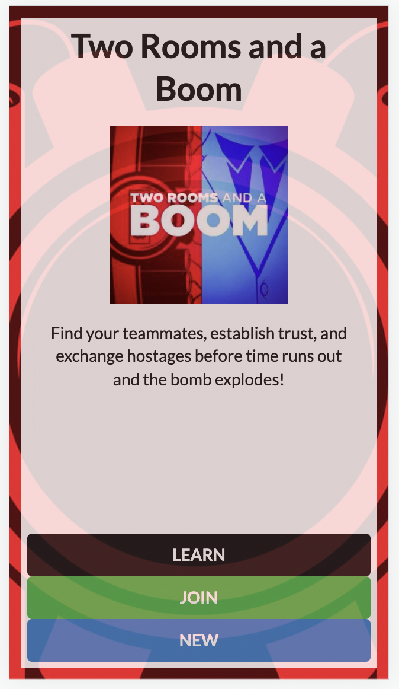
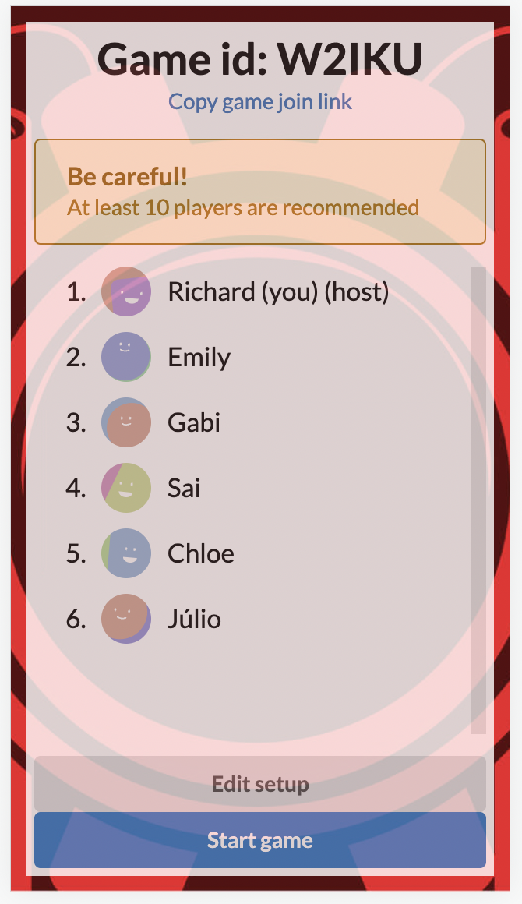
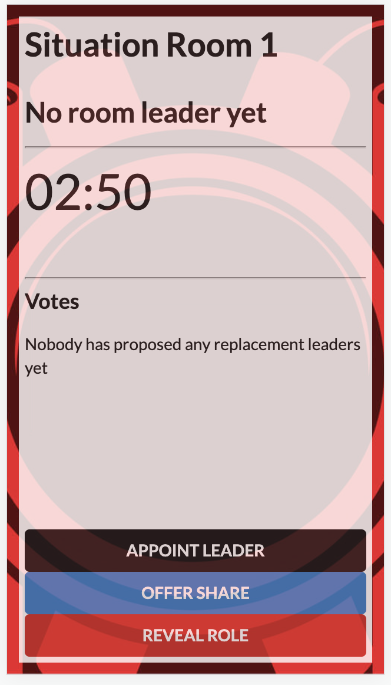
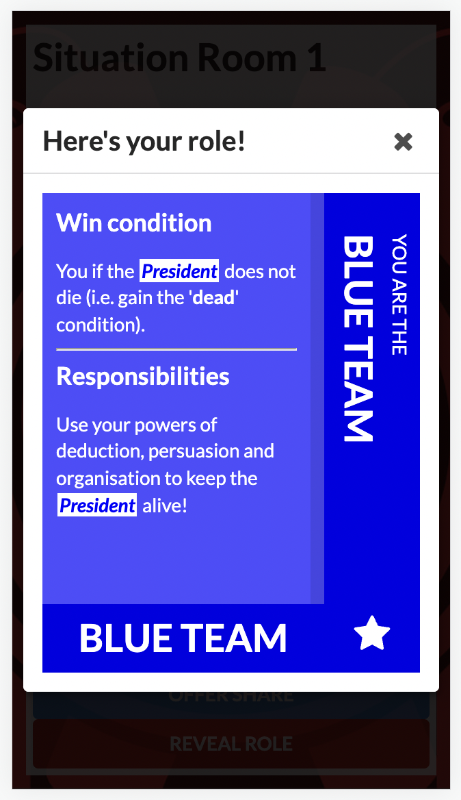

# Two Rooms and a Boom

  
  
  
  

[**Two Rooms and a Boom**](https://www.tuesdayknightgames.com/tworoomsandaboom) is a social game of hidden roles and deduction, involving players split into two different _physical_ rooms.

It is for **6-30 players**, and games take **as little as 10 minutes**.

This repo is is a (work-in-progress) web app implementation of it, as a replacement for the card set if you don't have immediate access. (You should buy the physical set, though - it's fun!)

_Note: you will still need to be with a group of players in-person._

- [Game rules](RULES.md)

### Acknowledgements

_Two Rooms and a Boom_ is a party game and card set originally developed by **[Tuesday Knight Games](https://www.tuesdayknightgames.com/)**.

They have a [free Print-n-Play version](https://www.tuesdayknightgames.com/tworoomsandaboom) of the game, which is licensed under [CC BY-NC-SA 4.0](https://creativecommons.org/licenses/by-nc-sa/4.0/), and which this repo builds off.

Accordingly, this repo and its contents are made available under the same license.
