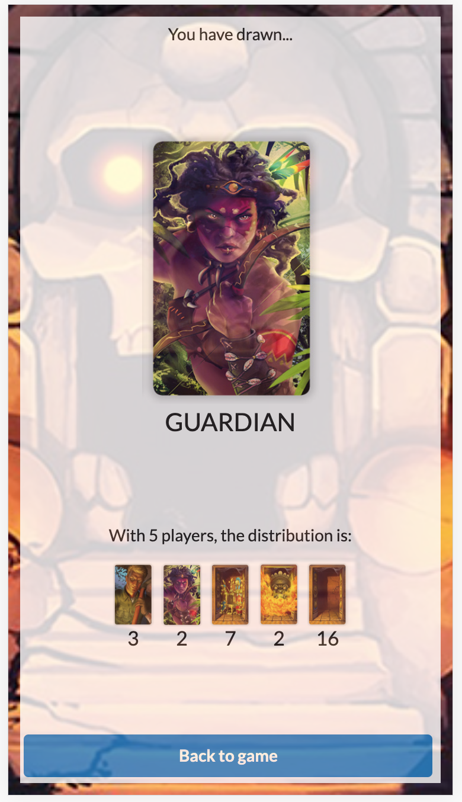
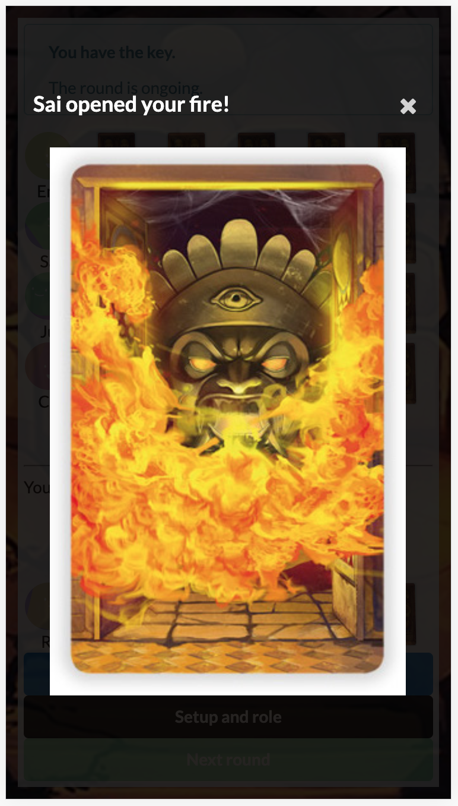

# Two Rooms and a Boom

  
  
  
  

[**Two Rooms and a Boom**](https://www.spiel-des-jahres.de/en/games/tempel-des-schreckens/) *(English: 'Temple of Terrors')*. is a quick-play party game that combines cooperative social deduction with bluffing, luck and chance.

It is for **3-10 players**, and games take **as little as 10 minutes**.

This repo is is a web app implementation of it, primarily intended for use on group video calls, although it can also be used to play in-person when you don't have access to a deck. (You should buy the physical set, though - it's fun!)

- [Game rules](RULES.md)
- [Basic strategy](STRATEGY.md)